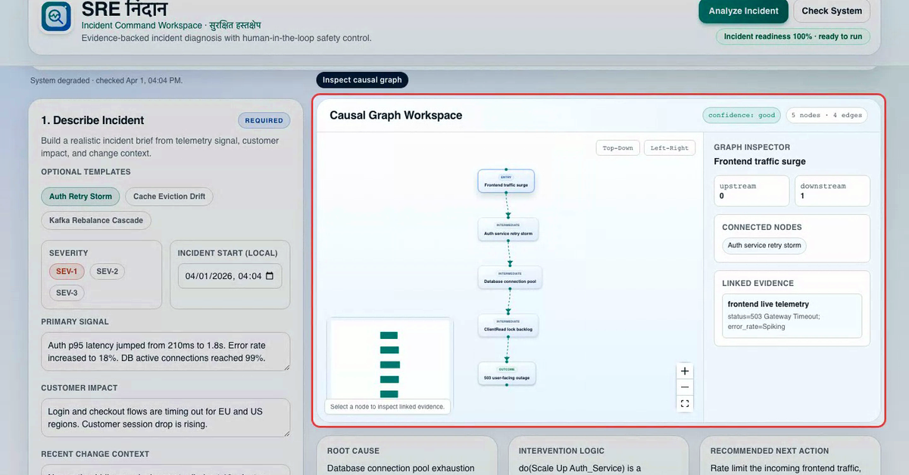
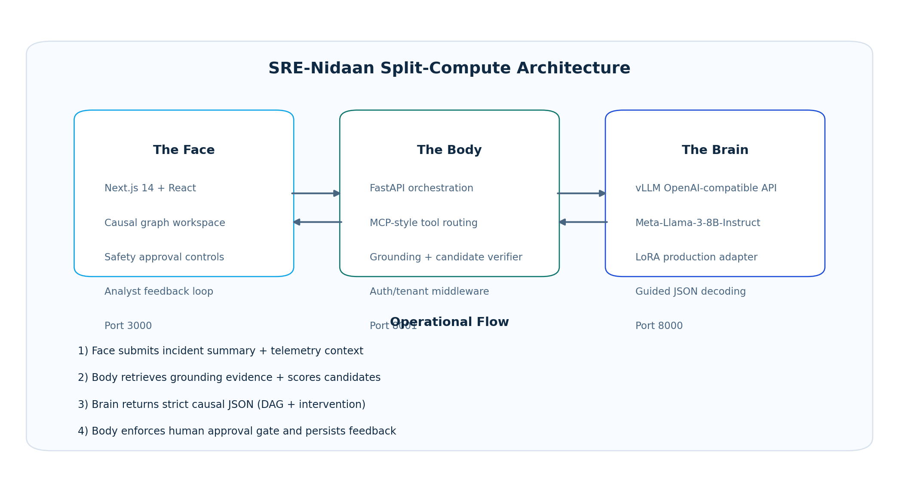
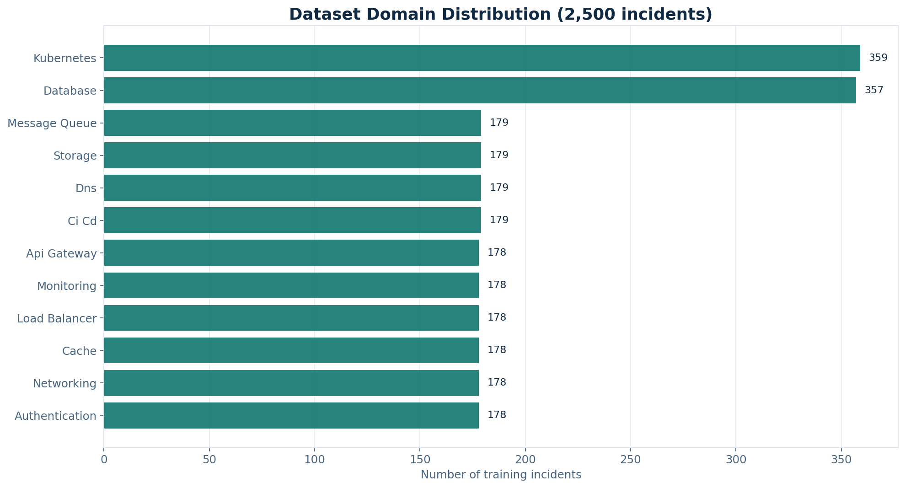
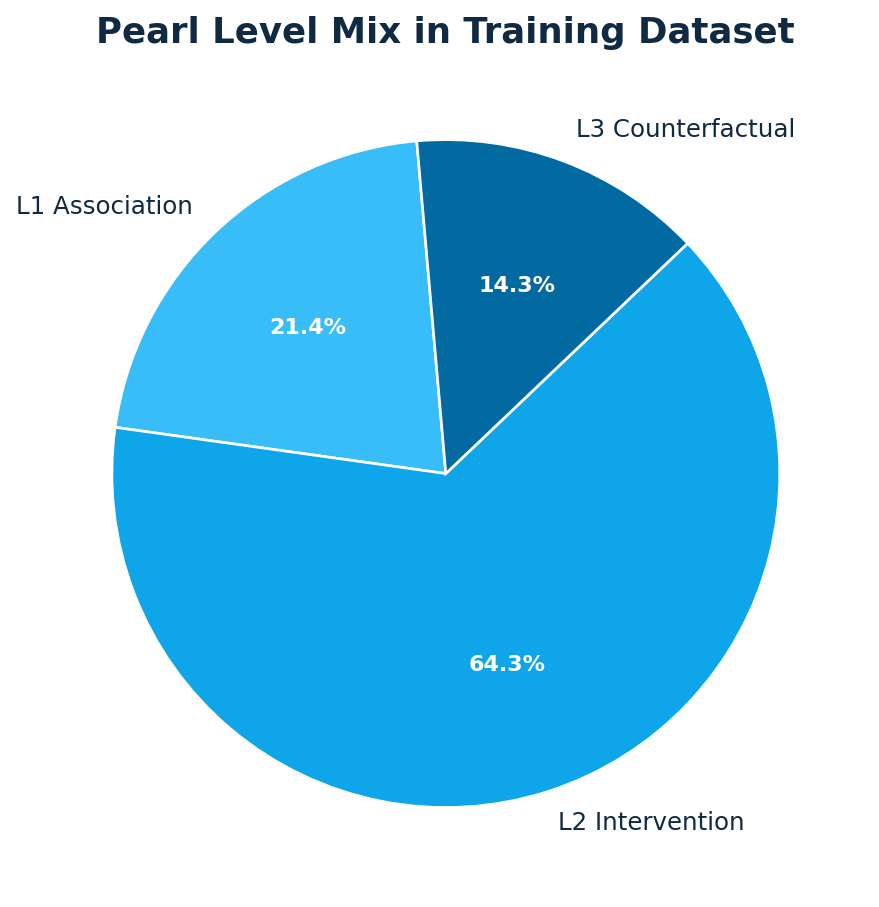
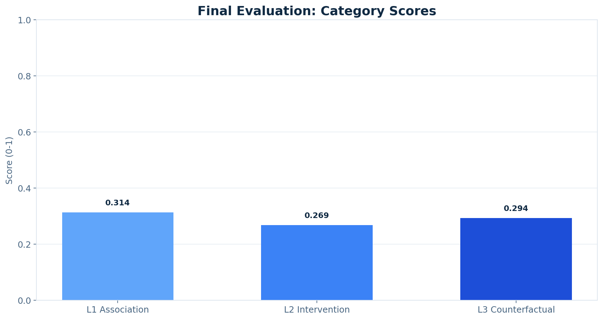
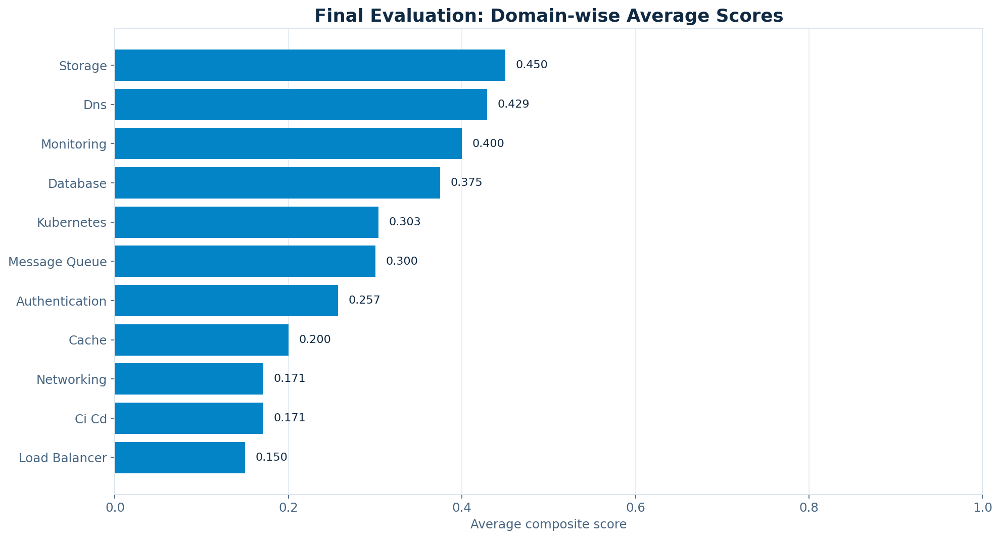
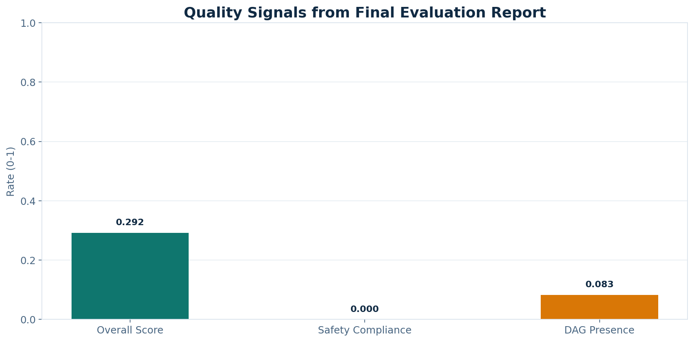
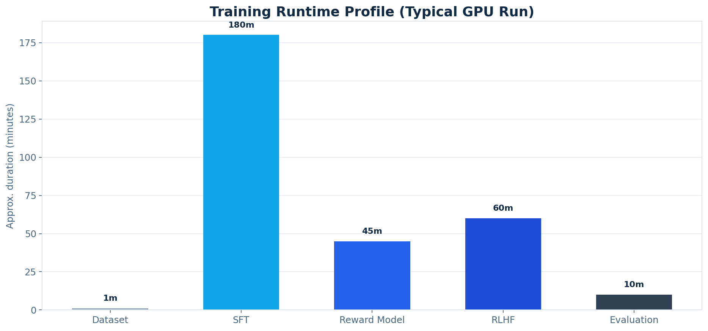

# SRE-Nidaan (SRE निदान)

[](https://huggingface.co/meta-llama/Meta-Llama-3-8B-Instruct)
[](https://opensource.org/licenses/Apache-2.0)
[](https://www.python.org/)
[](https://github.com/RitwijParmar/NEXUS-CAUSAL-v3.1)

Production-focused causal incident response copilot for SRE teams.

SRE-Nidaan is a 3-service system (`Face + Body + Brain`) that combines:

- structured incident analysis with causal DAG output
- grounding against telemetry + knowledge base evidence
- MCP-style tool routing in the backend
- strict human approval gating before interventions
- analyst feedback capture for continuous improvement

---

## Live Product

- Product (canonical): [https://sre-nidaan-122722888597.us-east4.run.app](https://sre-nidaan-122722888597.us-east4.run.app)
- Product alias: [https://sre-nidaan-face-122722888597.us-east4.run.app](https://sre-nidaan-face-122722888597.us-east4.run.app)
- Body API: [https://sre-nidaan-body-122722888597.us-east4.run.app](https://sre-nidaan-body-122722888597.us-east4.run.app)
- Brain API: [https://sre-nidaan-brain-ciiiagnzaq-uk.a.run.app](https://sre-nidaan-brain-ciiiagnzaq-uk.a.run.app)

---

## Demo Video

Click the thumbnail to watch the short narrated product walkthrough:

[](presentations/SRE_Nidaan_Demo_Recording_Voiceover_Indian.mp4)

Direct video link:
- [SRE_Nidaan_Demo_Recording_Voiceover_Indian.mp4](presentations/SRE_Nidaan_Demo_Recording_Voiceover_Indian.mp4)

---

## Why SRE-Nidaan Exists

In incidents, vanilla LLM responses can sound confident but still be unsafe:

- they often miss confounders
- they can recommend generic actions without grounding
- they do not naturally enforce safety gates

SRE-Nidaan addresses this by forcing structured causal outputs, scoring evidence overlap, and requiring human approval before high-impact actions.

---

## Architecture (Real Diagram)



### Service Responsibilities

- **Face (Next.js)**: operator UI, incident input, graph workspace, safety and feedback actions.
- **Body (FastAPI)**: orchestration, grounding retrieval, MCP tool calls, candidate verification, and persistence.
- **Brain (vLLM + LoRA)**: OpenAI-compatible inference serving Meta-Llama-3-8B-Instruct with production adapter.

### End-to-End Incident Flow

1. Operator provides incident brief and telemetry context.
2. Body fetches telemetry (`sre.telemetry.get_snapshot`) and retrieves grounding evidence from `ops/knowledge_base.json`.
3. Body prompts Brain with strict schema constraints (`guided_json`).
4. Body verifies candidate quality (evidence overlap, telemetry overlap, structural viability).
5. Body either returns accepted live analysis or deterministic grounded fallback.
6. Face renders DAG + reasoning; intervention requires human authorization.
7. Analyst feedback is persisted for future reward/preference improvements.

---

## Real Data & Evaluation Charts

All charts below are generated from project artifacts, not hand-drawn placeholders.

### Dataset Composition




### Evaluation Snapshot (`results/final_evaluation_report.json`)





### Runtime/Training Profile



---

## Repository Structure

```text
SRE-Nidaan/
├── backend/                      # FastAPI body service
│   └── main.py
├── frontend/                     # Next.js face service
│   ├── src/app/page.tsx
│   └── src/components/CausalGraph.tsx
├── src/                          # Training + runtime libraries
│   ├── data/
│   ├── training/
│   ├── evaluation/
│   ├── runtime/
│   └── utils/
├── scripts/                      # Pipeline and utility scripts
│   ├── 01_generate_dataset.py
│   ├── 02_run_sft.py
│   ├── 03_train_reward_model.py
│   ├── 04_run_rlhf.py
│   ├── 05_run_evaluation.py
│   ├── 06_select_best_sft_checkpoint.py
│   ├── 07_generate_structured_response.py
│   ├── 08_prepare_production_adapter.py
│   ├── record_site_demo.py
│   ├── add_demo_voiceover.py
│   └── generate_readme_charts.py
├── data/sre_nidaan_dataset.json
├── results/final_evaluation_report.json
├── ops/knowledge_base.json
├── inference_server.py           # Brain service
├── docker-compose.yml
└── deploy/gcp/                   # Cloud Run deployment assets
```

---

## Quick Start

### Prerequisites

- Python 3.9+
- Node.js 18+
- Docker (optional, recommended for full stack)
- NVIDIA GPU (required for Brain inference/training workloads)

Install dependencies:

```bash
git clone https://github.com/RitwijParmar/SRE-Nidaan.git
cd SRE-Nidaan
pip install -r requirements.txt
```

---

## Local Run (Native)

### 1) Prepare production adapter

```bash
export HF_TOKEN="your_hf_token"
python scripts/08_prepare_production_adapter.py
```

### 2) Start Brain

```bash
export MODEL_ID="meta-llama/Meta-Llama-3-8B-Instruct"
export NEXUS_LORA_PATH="$(pwd)/results/production_adapter"
python inference_server.py
```

### 3) Start Body

```bash
export VLLM_ENDPOINT="http://localhost:8000/v1"
export MODEL_ID="meta-llama/Meta-Llama-3-8B-Instruct"
export PRODUCTION_ARTIFACT_LABEL="checkpoint-1064"
uvicorn backend.main:app --host 0.0.0.0 --port 8001 --reload
```

### 4) Start Face

```bash
cd frontend
npm install
NEXT_PUBLIC_API_URL=http://localhost:8001 npm run dev
```

Open [http://localhost:3000](http://localhost:3000)

---

## Docker Run (3 Services)

```bash
export HF_TOKEN="your_hf_token"
export MODEL_ID="meta-llama/Meta-Llama-3-8B-Instruct"
python scripts/08_prepare_production_adapter.py
docker-compose up --build -d
```

Default ports:

- Face: `3000`
- Body: `8001`
- Brain: `8000`

---

## GCP Cloud Run Deployment

Use the deployment script:

```bash
export PROJECT_ID="your-gcp-project"
export REGION="us-east4"
export HF_TOKEN="your_hf_token"
bash deploy/gcp/deploy_cloud_run.sh
```

What it does:

- builds/pushes Face, Body, Brain images via Cloud Build
- deploys Brain on GPU (`nvidia-l4`)
- deploys Body and wires it to Brain `/v1`
- deploys Face and wires it to Body URL

---

## API Surface

### Health and integration

- `GET /health`
- `GET /api/integration-check`
- `GET /api/telemetry`

### Core analysis flow

- `POST /api/analyze-incident`
- `POST /api/interventions/authorize`
- `POST /api/analysis-feedback`

### MCP tool endpoints

- `GET /api/mcp/tools`
- `POST /api/mcp/call`

### Example: analyze incident

```bash
curl -X POST "http://localhost:8001/api/analyze-incident" \
  -H "Content-Type: application/json" \
  -H "x-tenant-id: demo-tenant" \
  -d '{
    "incident_summary": "Auth p95 latency rose from 210ms to 1.8s and DB connections reached 99%.",
    "candidate_count": 3
  }'
```

---

## Training Pipeline

The full model workflow follows:

1. **SFT (QLoRA)** on causal SRE examples
2. **Reward Modeling** for preference signal
3. **RLHF** for policy refinement

Run sequence:

```bash
python scripts/01_generate_dataset.py
python scripts/02_run_sft.py
python scripts/03_train_reward_model.py
python scripts/04_run_rlhf.py
python scripts/05_run_evaluation.py
```

Production serving strategy in this repo prioritizes stable SFT path (`checkpoint-1064`) with verifier + safety plane, while RLHF remains an optional research track.

---

## Security and Safety Controls

- tenant header enforcement (`x-tenant-id`) for API calls
- optional API key auth middleware (`x-api-key`) with env toggles
- human-in-the-loop intervention authorization endpoint
- analysis persistence and audit trail in SQLite (`feedback/analyst_feedback.db`)
- deterministic fallback generation when live inference is unavailable or low confidence

---

## Environment Variables (Important)

### Body (`backend/main.py`)

- `VLLM_ENDPOINT`
- `MODEL_ID`
- `PRODUCTION_ARTIFACT_LABEL`
- `GROUNDING_KB_PATH`
- `GENERATION_CANDIDATES`
- `GENERATION_MAX_TOKENS`
- `LIVE_ANALYSIS_TIMEOUT_SECONDS`
- `REQUIRE_API_AUTH`
- `API_AUTH_TOKEN`
- `REQUIRE_TENANT_ID`
- `ALLOWED_ORIGINS`
- `FEEDBACK_LOG_PATH`
- `FEEDBACK_DB_PATH`

### Brain (`inference_server.py`)

- `MODEL_ID`
- `NEXUS_LORA_PATH`
- `SERVING_BACKEND`
- `MAX_LORA_RANK`
- `MAX_MODEL_LEN`
- `GPU_MEMORY_UTILIZATION`
- `PORT`

---

## README Asset Regeneration

If dataset/evaluation files change, regenerate charts:

```bash
python scripts/generate_readme_charts.py
```

Generated outputs:

- `assets/readme/architecture_split_compute.png`
- `assets/readme/dataset_domain_distribution.png`
- `assets/readme/dataset_pearl_level_mix.png`
- `assets/readme/evaluation_category_scores.png`
- `assets/readme/evaluation_domain_scores.png`
- `assets/readme/evaluation_quality_signals.png`
- `assets/readme/training_runtime_profile.png`

---

## Current Limitations

- telemetry source defaults to static snapshot when live source is unavailable
- no full enterprise RBAC/SSO flow yet
- evaluation outcomes are highly sensitive to strict schema settings and prompt strategy
- RLHF path can underperform without careful reward-data alignment and checkpoint selection

---

## License

Apache 2.0
